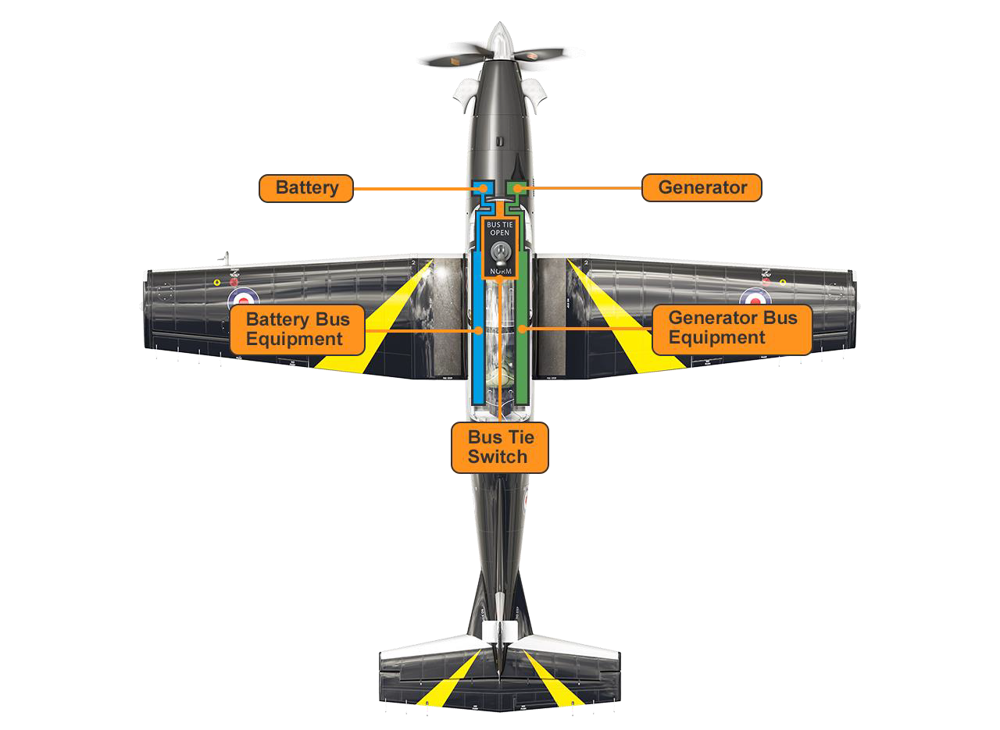

# Electrical System and Lighting

The primary power source for the aircraft is the generator attached to the Accessory Gearbox on the aft end of the engine. Secondary power is provided by the battery in the nosebay. An Auxiliary Battery in the port Avionics Bay provides power for essential systems in the event of both battery and generator failure. Lastly, external Power can be connected to the aircraft on the ground for engine start.

